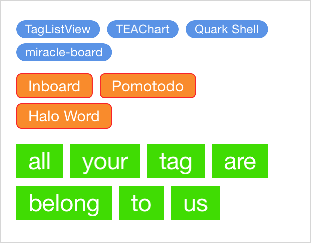
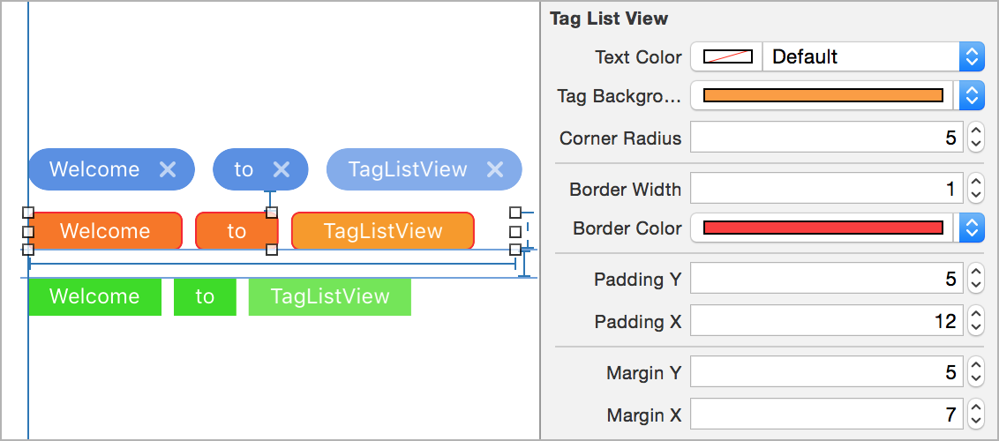

# TagListView

[](https://travis-ci.org/ElaWorkshop/TagListView)
[](http://cocoadocs.org/docsets/TagListView/)
[](https://github.com/ElaWorkshop/TagListView/blob/master/LICENSE)
[](https://github.com/Carthage/Carthage)

Simple and highly customizable iOS tag list view, in Swift.

Supports Storyboard, Auto Layout, and @IBDesignable.



## Usage

The most convenient way is to use Storyboard. Drag a view to Storyboard and set Class to `TagListView` (if you use CocoaPods, also set Module to `TagListView`). Then you can play with the attributes in the right pane, and see the preview in real time thanks to [@IBDesignable](http://nshipster.com/ibinspectable-ibdesignable/).



You can add tag to the tag list view, or set custom font and alignment through code:

```swift
tagListView.textFont = UIFont.systemFontOfSize(24)
tagListView.alignment = .Center // possible values are .Left, .Center, and .Right

tagListView.addTag("TagListView")
tagListView.addTags(["Add", "two", "tags"])

tagListView.insertTag("This should be the second tag", at: 1)

tagListView.setTitle("New Title", at: 6) // to replace the title a tag

tagListView.removeTag("meow") // all tags with title “meow” will be removed
tagListView.removeAllTags()
```

You can implement `TagListViewDelegate` to receive tag pressed event:

```swift
// ...
{
    // ...
    tagListView.delegate = self
    // ...
}

func tagPressed(title: String, tagView: TagView, sender: TagListView) {
    print("Tag pressed: \(title), \(sender)")
}
```

You can also customize a particular tag, or set tap handler for it by manipulating the `TagView` object returned by `addTag(_:)`:

```swift
let tagView = tagListView.addTag("blue")
tagView.tagBackgroundColor = UIColor.blueColor()
tagView.onTap = { tagView in
    print("Don’t tap me!")
}
```

Be aware that if you update a property (e.g. `tagBackgroundColor`) for a `TagListView`, all the inner `TagView`s will be updated.

## Installation

Use [CocoaPods](https://github.com/CocoaPods/CocoaPods):

```ruby
pod 'TagListView', '~> 1.0'
```

Or [Carthage](https://github.com/Carthage/Carthage):

```ruby
github "ElaWorkshop/TagListView" ~> 1.0
```

Or drag **TagListView** folder into your project.

### Older Swift Versions?

Currently, the `master` branch is using Swift 5.

For Swift 4, use version [1.4.0](https://github.com/ElaWorkshop/TagListView/releases/tag/1.2.0) or [swift-4] branch. For Swift 3, use version [1.2.0](https://github.com/ElaWorkshop/TagListView/releases/tag/1.2.0) or [swift-3](https://github.com/ElaWorkshop/TagListView/tree/swift-3) branch. For Swift 2, use version [1.0.1](https://github.com/ElaWorkshop/TagListView/releases/tag/1.0.1) or [swift-2.3](https://github.com/ElaWorkshop/TagListView/tree/swift-2.3) branch. For Swift 1.2, use version [0.2](https://github.com/ElaWorkshop/TagListView/releases/tag/0.2).

## Contribution

Pull requests are welcome! If you want to do something big, please open an issue to let me know first.

## License

MIT
